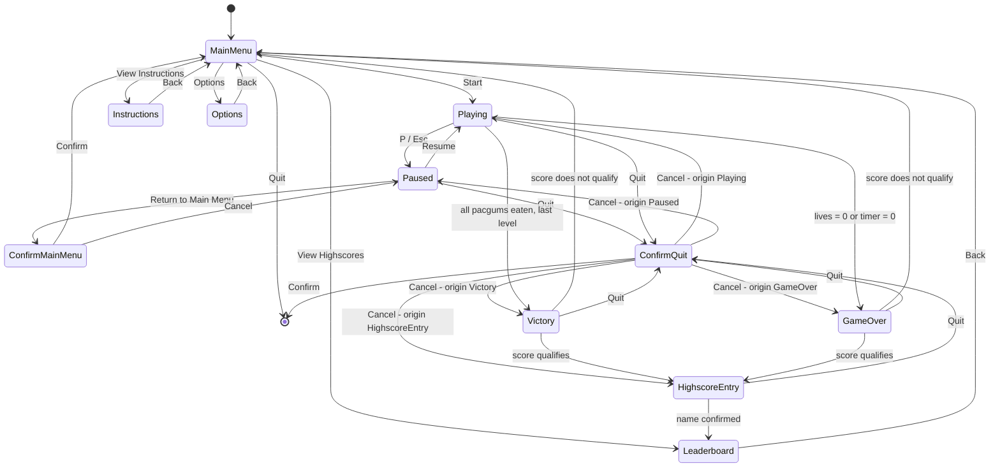

# PacMan — Software Architecture

State machine lives in `App`. `GameEngine` only runs during the `PLAYING`
state and emits transition events that `App` consumes each frame.
`ScreenManager` and `GameEngine` are siblings under `App`.

Open this file in VSCode preview (`Ctrl+Shift+V`) or view it on GitHub
to see the diagrams rendered.

To regenerate the `.svg` / `.png` exports from the `.dot` sources:
```bash
dot -Tsvg docs/architecture.dot   -o docs/architecture.svg
dot -Tpng docs/architecture.dot   -o docs/architecture.png
dot -Tsvg docs/state-machine.dot  -o docs/state-machine.svg
dot -Tpng docs/state-machine.dot  -o docs/state-machine.png
```

---

## Component diagram

```mermaid
flowchart TB
    classDef app     fill:#1e3a8a,stroke:#1e3a8a,color:#fff,font-weight:bold
    classDef service fill:#0f766e,stroke:#0f766e,color:#fff
    classDef engine  fill:#7c2d12,stroke:#7c2d12,color:#fff
    classDef state   fill:#b45309,stroke:#b45309,color:#fff
    classDef screen  fill:#6b21a8,stroke:#6b21a8,color:#fff
    classDef leaf    fill:#374151,stroke:#374151,color:#fff

    App["App<br/>(MAIN_MENU / PLAYING / PAUSED / INSTRUCTIONS<br/>/ GAME_OVER / VICTORY / HIGHSCORE_ENTRY<br/>/ LEADERBOARD / OPTIONS<br/>/ CONFIRM_QUIT / CONFIRM_MAIN_MENU)"]:::app

    CM["ConfigManager<br/>(parser -&gt; validator -&gt; Pydantic models)"]:::service
    HS["HighscoreStore<br/>(top-10, JSON-backed)"]:::service
    AM["AssetManager<br/>(sprite sheet, palettes,<br/>animations, fonts)"]:::service
    SM["SoundManager<br/>(SFX + music, intro-to-loop chain)"]:::service
    DM["DisplayManager<br/>(window, resolution, fullscreen)"]:::service
    IR["InputRouter<br/>(routes InputAction per state)"]:::service

    App --> CM
    App --> HS
    App --> AM
    App --> SM
    App --> DM
    App --> IR

    subgraph engine["GameEngine  (one instance per game)"]
        GE["GameEngine<br/>(EngineState machine)"]:::engine
        ES["EngineState<br/>STARTING -&gt; PLAYING &lt;-&gt; DYING<br/>/ LEVEL_TRANSITION<br/>-&gt; GAME_OVER / GAME_WON"]:::state
        MZ["Maze<br/>(wraps mazegen, perfect=False<br/>derives spawns / pacgums)"]:::leaf
        CM2["CharacterManager"]:::leaf
        PAC["Pacman<br/>(direction buffer, smooth step,<br/>speed multiplier, noclip)"]:::leaf
        GH["Ghost x4<br/>(Blinky / Pinky / Inky / Clyde)"]:::leaf
        TM["Timer x6<br/>(intro / death / level-transition /<br/>freeze / score-overlay / super-pacgum)"]:::leaf
        CH["Cheats<br/>(invincibility, ghost_freeze,<br/>timer_freeze)"]:::leaf
        EV["events list<br/>(ItemEatenEvent, GameEvent<br/>one frame lifetime)"]:::leaf
        MC["music_cue<br/>(MusicCue enum read by App)"]:::leaf

        GE --> ES
        GE --> MZ
        GE --> CM2
        CM2 --> PAC
        CM2 --> GH
        GE --> TM
        GE --> CH
        GE --> EV
        GE --> MC
    end

    App --> GE

    subgraph screens["ScreenManager"]
        SCR["ScreenManager"]:::screen
        MN["MainMenuScreen<br/>(animated logo + Pac-Man chase)"]:::leaf
        PL["PlayingScreen<br/>(maze, HUD, level-transition<br/>overlay, palette flicker)"]:::leaf
        PA["PauseScreen<br/>(+ CONFIRM_QUIT overlay<br/>+ CONFIRM_MAIN_MENU overlay)"]:::leaf
        GO["GameOverScreen / VictoryScreen"]:::leaf
        HE["HighscoreEntryScreen"]:::leaf
        LB["LeaderboardScreen"]:::leaf
        IN["InstructionsScreen"]:::leaf
        OP["OptionsScreen<br/>(resolution / fullscreen / sound)"]:::leaf

        SCR --> MN
        SCR --> PL
        SCR --> PA
        SCR --> GO
        SCR --> HE
        SCR --> LB
        SCR --> IN
        SCR --> OP
    end

    App --> SCR

    HS -. "load top-10 at boot / save on game end" .-> LB
    HS -. "save new entry" .-> HE
    AM -. "serves sprites/fonts" .-> PL
    AM -. "serves sprites/fonts" .-> SCR
    GE -. "emits GameLost / GameWon" .-> App
    SCR -. "emits StartGame / Quit / ..." .-> App
```



---

## State machine


