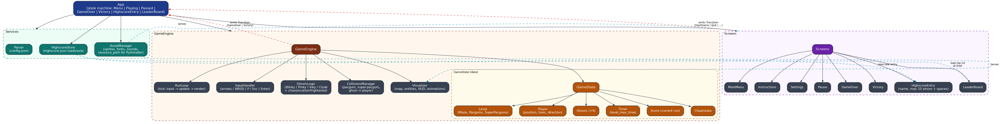
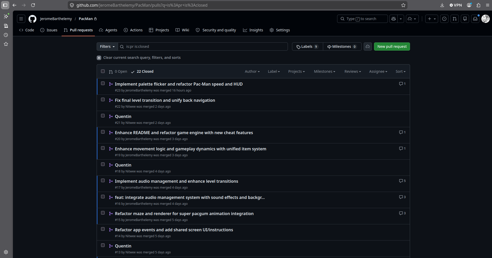
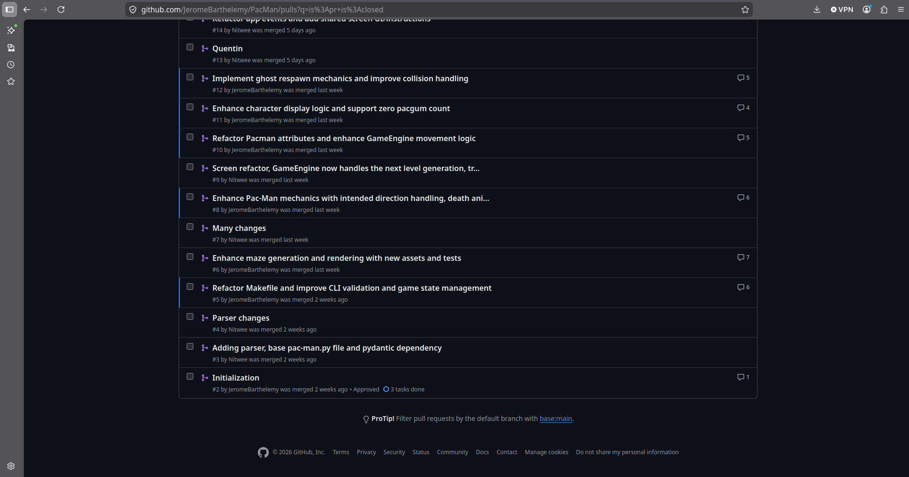
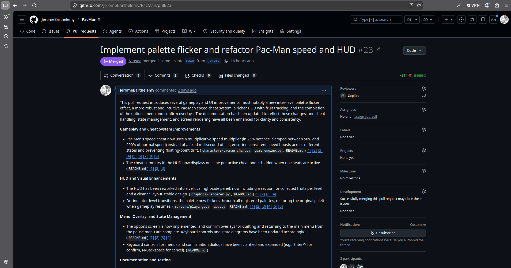
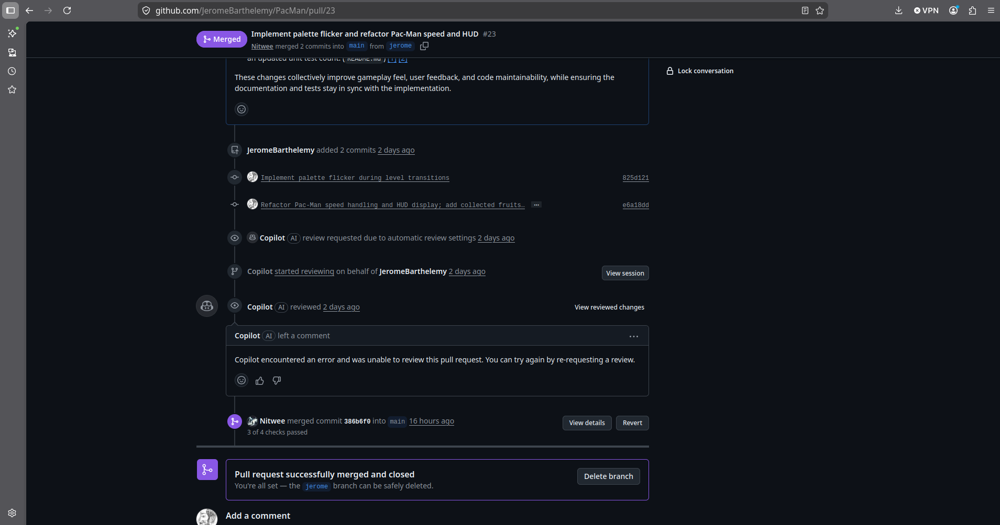
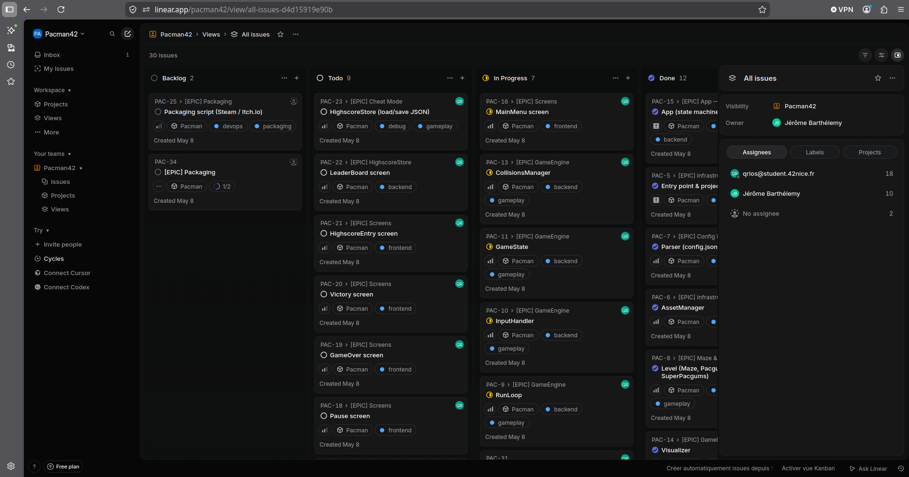
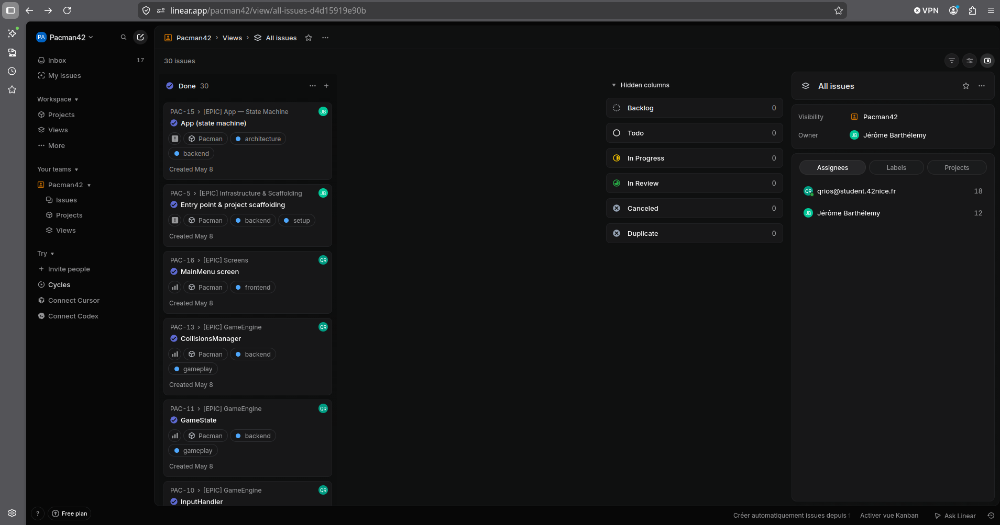
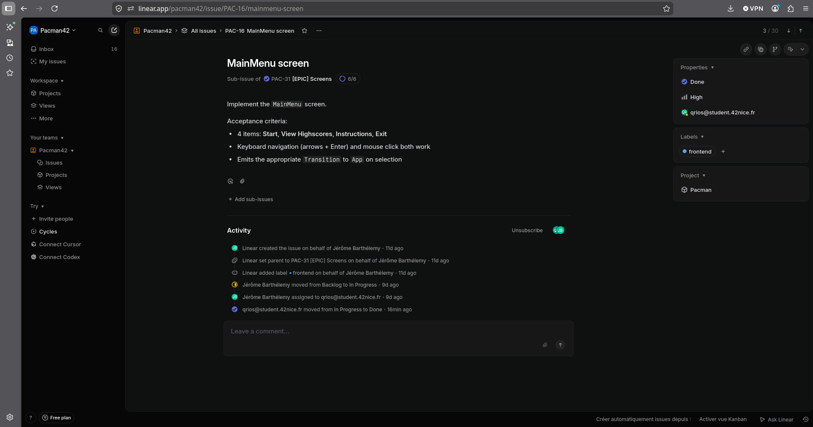

# Project Management

## Overview

This document describes how the project was organised and tracked across its
full development cycle. We used **GitHub** for source control and code review,
and **Linear** for issue tracking, sprint planning, and progress visibility.

---

## Architecture

The full architecture document is available here: [architecture.md](architecture.md)

The diagrams below were produced at the start of the project and define the intended module structure and game state machine. The implementation followed these designs throughout development.

---

## Team organisation

| Member   | Branch    | Primary responsibilities |
|----------|-----------|--------------------------|
| jbarthel | `jerome`  | Core game loop, ghost AI, HUD, cheat system, packaging |
| qrios    | `quentin` | Maze integration, config parser, highscore, screens, audio |

Each developer worked on their own branch and opened a **Pull Request** into
`main` when a feature was ready. PRs required at least one peer review before
merging.

---

## Workflow with GitHub

Repository: [JeromeBarthelemy/PacMan](https://github.com/JeromeBarthelemy/PacMan)

All work went through Pull Requests:

1. Feature / bugfix developed on a personal branch.
2. PR opened against `main` with a description of the change.
3. Peer reviewed: inline comments, approval required.
4. Merged into `main` once approved and CI checks passed.

<!-- Screenshot: GitHub pull request list -->

<!-- Screenshot: Example PR review with inline comments -->

---

## Workflow with Linear

Project board: [pacman42 / PacMan](https://linear.app/pacman42/project/pacman-b7fa9069d91d/overview)

Linear served as our single source of truth for tasks and milestones.

- **Milestones** mapped to the main spec chapters (Config, Maze, Gameplay,
  UI, Highscore, Packaging).
- Each milestone contained **Issues** with descriptions, acceptance criteria,
  and an assignee.
- Issues moved through the standard cycle: **Backlog → In Progress → In Review
  → Done**.

<!-- Screenshot: Linear project board (Kanban view) -->

<!-- Screenshot: Linear issue detail with checklist -->

---

## Timeline

| Phase | Content | Status |
|-------|---------|--------|
| Days 1-2 | Project setup, config parser, maze integration | Done |
| Days 3-5 | Player movement, pacgum collection, basic ghosts | Done |
| Days 6-9 | Ghost AI, frightened mode, scoring, highscore | Done |
| Days 9-10 | All screens, HUD, cheat mode, audio | Done |
| Days 11-12 | Palette system, level transitions, polish | Done |
| Days 13-14 | Tests (151), mypy strict, packaging | Done |

---

## Risk analysis

| Risk | Likelihood | Impact | Mitigation |
|------|-----------|--------|------------|
| mazegen API changes during peer review | Medium | High | Adapter layer in `maze.py`; re-install tested |
| Config supplied by reviewer breaks the game | High | High | All values clamped to safe defaults; 0 tracebacks |
| PyInstaller asset path issues on target machine | Medium | Medium | `--add-data` tested; relative paths inside bundle |
| Merge conflicts on shared files | Medium | Low | Short-lived branches; daily sync |

---

## Acceptance test plan

| Feature | Test method | Result |
|---------|-------------|--------|
| Config parser with malformed JSON | Unit tests + manual bad file | Pass |
| Highscore top-10, persistence | Unit tests (`test_highscore.py`) | Pass |
| Maze generation seed 42 (level 1) | Unit test reproducibility check | Pass |
| Ghost frightened → eaten → respawn | Manual gameplay | Pass |
| Cheat combos (8 shortcuts) | Manual peer-review playthrough | Pass |
| Level transition, score carry-over | Manual gameplay (10 levels) | Pass |
| Game over → name entry → leaderboard | Manual full run | Pass |
| mypy --strict | `make lint-strict` | Pass |
| flake8 | `make lint` | Pass |
| 151 pytest tests | `make test` | Pass |
